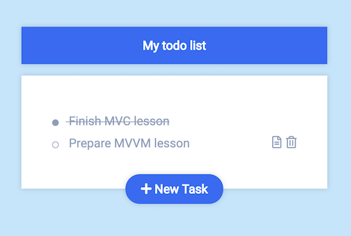

# App Architecture 01 | Model View Controller

- App architecture is about structuring code
- MVC organizes code into 3 different buckets
- Code is either a model, a view or a controller

## Definitions

### Model

- Contains the business logic
- Defines the structure of data
- Knows how to store and retrieve data from potentially remote storages

### View

- Takes data and populates templates to generate consumer facing HTML or JSON
- No access to databases, no access to request/response objects, only accesses the passed data

### Controller

- Is the glue between the model and view layer
- Typically has access to some meta information about the consumers needs
- Gathers data from the model layer, passes it to the view and finally returns the response to the consumer

## Applying MVC to an Express application



### App structure

- index.js --> Main entry point for the application
- controllers --> Directory that contains all controllers / routes
- models --> Directory that contains all models / data sources
- views --> Directory that contains all views

### Tiny wiring start script

- Checkout the index.js
- Sets up a basic express app
- Loads every controller and adds it to the routings
- Runs the app

### Examples

<details>
<summary>The following code snippet is describing a Task model</summary>
<p>

e.g. `models/task.js`

```javascript
const uuid = require("uuid/v4");

const tasks = []; // This is our data storage for now

module.exports = {
  find: id => tasks.find(task => task.id === id),
  findAll: () => tasks,
  remove: id => tasks = tasks.filter(task => task.id !== id),
  add: task => tasks.push(Object.assign({ id: uuid() }, task))
};
```

Please note, that function are currently synchronous and it might be a better idea to use promises instead.
</p>
</details>

<details>
<summary>The following snippet shows an exemplary Task related view</summary>
<p>

e.g. `views/tasks/index.js`

```js
module.exports = (tasks) => `<html>
    <head><title>TODO</title></head>
    <body>
        <h1>To Do App</h1>
        ${tasks.map(task => `
            <div class="task">
                <h2>${task.title}</h2>
                <p>${task.description}</p>
            </div>
        `).join("")}
    </body>
</html>`;
```
</p>
</details>

<details>
<summary>The following snippet shows a controller around tasks</summary>
<p>

e.g. `controllers/tasks.js`

```js
const { Router } = require("express");
const tasksController = Router();

const Task = require("../models/task");
const TasksView = require("../views/tasks");

tasksController.get("/tasks", (req, res) => {
  const tasks = Task.findAll();
  const html = TasksView.index(tasks);

  res.send(html);
});

module.exports = tasksController;
```
</p></details>

## Instructions

Let's build a todo application where you can add your personal tasks, mark them as accomplished as well as remove them again.

1. Create a controller to handle all tasks related actions. Start with the page that lists all tasks.
2. Create a task related View that is used in your controller and which contains the entire HTML for your page.
3. Add a form to that page which allows the creation of a new task (e.g. title + description). The form should perform a POST request.
4. Extend the existing controller to handle the post request.
5. Create a Task model that handles reading, creating, deleting and updating of tasks. For the sake of simplicity, you could store the tasks in a local variable. Try to make the model asynchronous, so that we could replace it later with a real database connection.
6. Wiring things up: The controller should use the tasks Model to read and manipulate tasks. Hand over to the retrieved data to the view and send the result to the consumer.
7. Add the possibility to delete a task.
8. Cover the View and Model layer with tests.
9. Bonus: Add the possibility to mark a task as completed.
